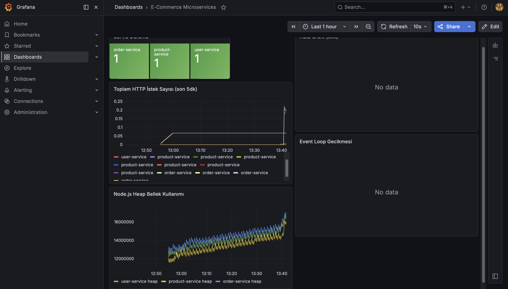

# E-Commerce Microservices


Cloud-native mimariyle geliştirilmiş, mikroservis tabanlı e-ticaret backend platformu.

---

## Proje Hakkında

Bu proje, küçük ve orta ölçekli e-ticaret işletmelerinin ihtiyaç duyduğu backend altyapısını cloud-native bir yaklaşımla sunar. Her servis bağımsız olarak çalışır, ölçeklenir ve deploy edilir. Trafik arttığında sistem otomatik büyür, bir servis çökerse diğerleri etkilenmez.

---

## Mimari

```
                        ┌─────────────────────────┐
                        │     NGINX Ingress        │
                        │     Load Balancer        │
                        └────┬─────────┬──────┬────┘
                             │         │      │
               ┌─────────────▼─┐ ┌─────▼────┐ ┌▼─────────────┐
               │  User Service │ │ Product  │ │ Order Service│
               │   :3001       │ │ Service  │ │   :3003      │
               └───────┬───────┘ │  :3002   │ └──────┬───────┘
                       │         └─────┬────┘        │
               ┌───────▼───────┐ ┌─────▼────┐ ┌──────▼───────┐
               │  PostgreSQL   │ │PostgreSQL│ │  PostgreSQL  │
               │  (users)      │ │(products)│ │  (orders)    │
               └───────────────┘ └──────────┘ └──────────────┘
                                       │
                        ┌──────────────▼──────────────┐
                        │   Prometheus + Grafana       │
                        │   Monitoring & Dashboard     │
                        └─────────────────────────────┘
```

---

## Servisler

### Kullanıcı Servisi (User Service)
Kimlik doğrulama ve kullanıcı yönetimini üstlenir.

| Method | Endpoint | Açıklama |
|--------|----------|----------|
| POST | `/api/users/register` | Yeni kullanıcı kaydı |
| POST | `/api/users/login` | Giriş yap, JWT al |
| GET | `/api/users/profile` | Profil bilgilerini getir |
| PUT | `/api/users/profile` | Profil güncelle |

### Ürün Servisi (Product Service)
Ürün kataloğu ve stok yönetimini yürütür.

| Method | Endpoint | Açıklama |
|--------|----------|----------|
| GET | `/api/products` | Tüm ürünleri listele |
| GET | `/api/products/:id` | Ürün detayını getir |
| POST | `/api/products` | Yeni ürün ekle |
| PUT | `/api/products/:id` | Ürün güncelle |
| DELETE | `/api/products/:id` | Ürün sil |

### Sipariş Servisi (Order Service)
Sipariş oluşturma ve takibini yönetir.

| Method | Endpoint | Açıklama |
|--------|----------|----------|
| POST | `/api/orders` | Sipariş oluştur |
| GET | `/api/orders` | Siparişleri listele |
| GET | `/api/orders/:id` | Sipariş detayını getir |
| PUT | `/api/orders/:id/cancel` | Siparişi iptal et |

---

## Teknoloji Yığını

| Katman | Teknoloji |
|--------|-----------|
| Dil | Node.js + TypeScript |
| Veritabanı | PostgreSQL (servis başına ayrı) |
| Container | Docker |
| Orchestration | Kubernetes + Helm |
| CI/CD | GitHub Actions |
| Monitoring | Prometheus + Grafana |
| API Gateway | NGINX Ingress |

---

## Kurulum

### Gereksinimler
- Docker
- Kubernetes (Minikube)
- Helm
- Node.js 20+

### Local Geliştirme (Docker Compose)

```bash
# Repoyu klonla
git clone https://github.com/FurkanAkkamis25/ecommerce-microservices.git
cd ecommerce-microservices

# Tüm servisleri başlat
docker-compose up

# Servislere eriş
# User Service    → http://localhost:3001
# Product Service → http://localhost:3002
# Order Service   → http://localhost:3003
```

### Kubernetes Deploy (Helm)

```bash
# Minikube başlat
minikube start

# Helm ile deploy et
helm install ecommerce ./helm/ecommerce --namespace ecommerce --create-namespace

# Servisleri kontrol et
kubectl get pods -n ecommerce
```

---

## CI/CD Pipeline

`main` branch'e her push yapıldığında GitHub Actions otomatik olarak:

1. Testleri çalıştırır
2. Docker image'larını build eder
3. GitHub Container Registry'ye push eder
4. Kubernetes'e deploy eder

---

## Monitoring

Prometheus metrikleri toplar, Grafana ile görselleştirir.

- Grafana Dashboard → `http://localhost:3100`
- Prometheus → `http://localhost:9090`

### Grafana Dashboard



Dashboard panelleri:
- **Servis Durumu** — 3 servisin anlık sağlık durumu
- **Toplam HTTP İstek Sayısı** — Son 5 dakikadaki istek hızı
- **Hata Oranı (5xx)** — Servis bazlı hata oranı
- **Node.js Heap Bellek** — Bellek kullanımı
- **Event Loop Gecikmesi** — Servis performansı

---

## Proje Yapısı

```
ecommerce-microservices/
├── services/
│   ├── user-service/
│   ├── product-service/
│   └── order-service/
├── k8s/                  # Kubernetes manifestleri
├── helm/                 # Helm chart
├── monitoring/           # Prometheus & Grafana config
├── .github/workflows/    # CI/CD pipeline
└── docker-compose.yaml
```
